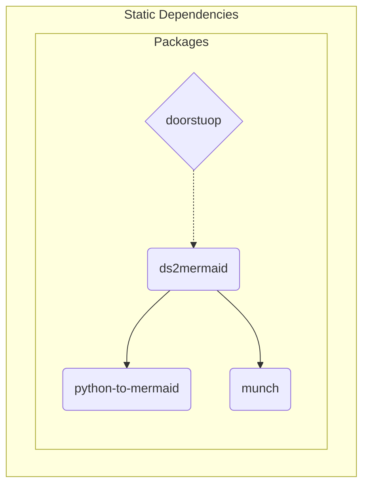

# 1.0 The ds2mermaid package provides a convenient interface and baseline {#SDD001}

The ds2mermaid package provides a convenient interface and baseline
format for generating a mermaid diagram (source) from doorstop item
links. The primary build/test dependency is python-to-mermaid, while
doorstop is the primary runtime dependency for the required input
data. Package dependencies are shown in Figure 1 below:

  
ds2m_dependency_graph source

  ds2mermaid dependency graph showing primary software units.

