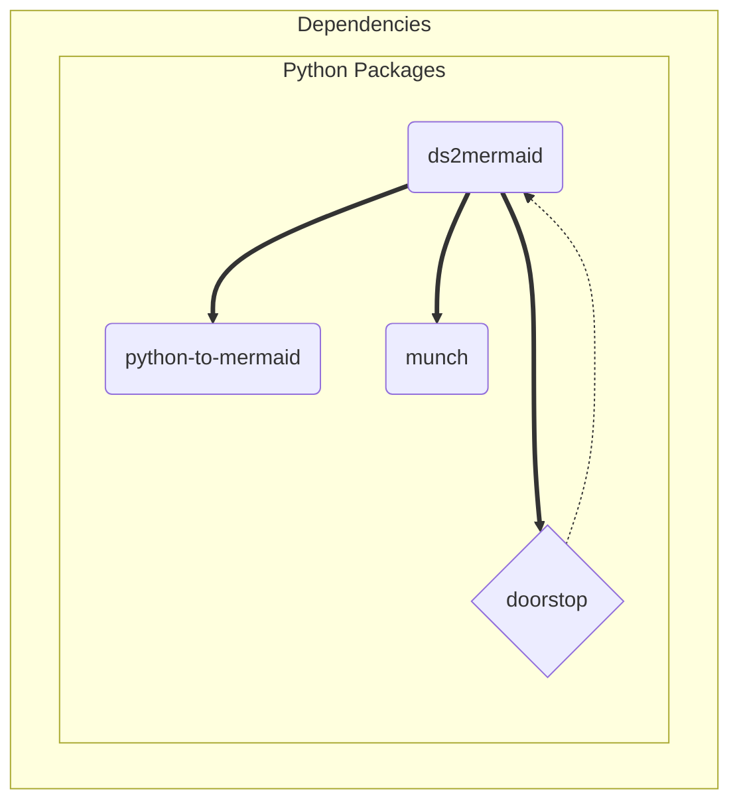

# Design Elements

The ds2mermaid package provides a convenient interface and baseline
(graph) format for generating a mermaid diagram with subgraphs from
doorstop item links.

The primary install dependencies are python-to-mermaid, doorstop, and
munch, where doorstop is the primary runtime dependency for the actual
diagram input data. Complete package dependencies are shown in the
figure below:

```{figure} assets/ds2m_dependency_graph.svg
:width: 90 %
:align: center
:alt: doorstop-to-mermaid software units

Doorstop-To-Mermaid Software Units (captured from mermaid to SVG or PNG).
```


<details>
  <summary>ds2m_dependency_graph source</summary>
  ds2mermaid dependency graph showing primary software units.


</details>

## Design decisions

Python-to-mermaid provides a basic set of mermaid diagram classes, mainly
MermaidDiagram, MermaidEdge, and MermaidNode. The primary diagram class
provides methods to add nodes and edges, as well as a ``to_mermaid()``
method to generate the final diagram text as a string.

ds2mermaid satisfies the following decision points:

* MermaidGraph is a sublass of MermaidDiagram with its own ``to_subgraph()``
  method
* MermaidGraph interface includes diagram type and direction, as well as
  a list of subgraph names
* new class to represent subgraph items (currently name and node-list)
* discovered doorstop document prefixes become subgraph labels
* document item uids become subgraph node labels
* document links become subgraph edges

Customizing node shapes or styling graph attributes will most likely need
a user config, eg, a YAML configuration in XDG platform path.