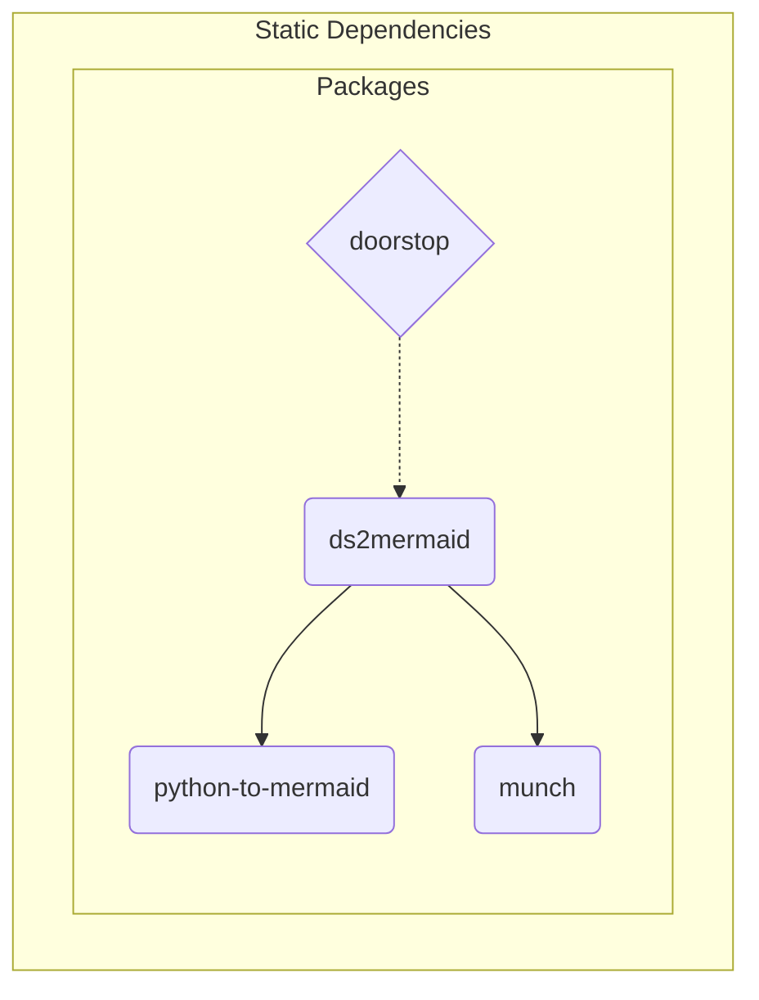

The ds2mermaid package provides a convenient interface and baseline
format for generating a mermaid diagram (source) from doorstop item
links. The primary build/test dependency is python-to-mermaid, while
doorstop is the primary runtime dependency for the required input
data. Package dependencies are shown in Figure 1 below:

```{figure} assets/ds2m_dependency_graph.svg
:width: 90 %
:align: center
:alt: doorstop-to-mermaid software units

Doorstop-To-Mermaid Software Units (captured from mermaid to SVG or PNG).
```

<details>
  <summary>ds2m_dependency_graph source</summary>
  ds2mermaid dependency graph showing primary software units.


</details>
